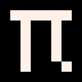

# pi 

The retro game development engine for Go, inspired by [Pico-8](https://www.lexaloffle.com/pico-8.php) and powered by [Ebitengine](https://ebiten.org/).

## FAQ

### Is this a new fantasy console?

No, it's not. It's rather a game development library with dev-tools which make it simple (and fun!) to write retro games in Go.

### What is a retro game?

It's a game that resembles old 8-bit/16-bit games. This usually means:

* (extremely) Low resolution (like 128x128 pixels)
* Limited number of colors (like 16)
* Very small number of assets (like 256 sprites, map having up to 8K tiles)
* Small number lines of code (thousands rather than millions)
* Sound effects and music made using predefined synth instruments and effects 

### What similarities does Pi have with Pico-8?

* Most API function names are similar and behave the same way.
* Screen resolution is small, and the number of colors is limited. Although in Pi you can change the resolution and palette.
* You have one small sprite sheet.

### Why would I use it?

Because it's the easiest way to write a game in Go. IMHO ;)

### Is Pi ready to use?

Pi is under development. Only limited functionality is provided. API is not stable. See [ROADMAP](docs/ROADMAP.md) for details.

## How to get started?

1. Install dependencies 
   * [Go 1.18+](https://go.dev/dl/)
   * If not on Windows, please install additional dependencies for [Linux](docs/install-linux.md) or [macOS](docs/install-macos.md).
2. Try examples from [examples](examples) directory.
3. Create a new game using provided [Github template](https://github.com/elgopher/pi-template).
4. Read the [documentation](https://pkg.go.dev/github.com/elgopher/pi).

### How to edit PNG files like sprite-sheet.png and custom-font.png?

* Use a pixel-art editor which supports indexed color mode, such as [Aseprite](https://www.aseprite.org/) or [LibreSprite](https://libresprite.github.io/).
* Palette for the game is stored inside sprite-sheet.png. 
