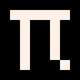
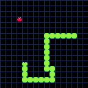

# pi 

[][pi-godoc]
[][pi-codecov]
[][repostatus-active]

## Table of Contents

- [Introduction](#introduction)
- [What defines the retro games made with Pi?](#what-defines-the-retro-games-made-with-pi)
- [Why Pi?](#why-pi)
- [How to get started?](#how-to-get-started)
- [How does it work?](#how-does-it-work)
- [FAQ](#faq)
- [Attributions](#attributions)

## Introduction

Pi is a game engine for creating retro games for modern computers. Its goal is to limit possibilities — to spark creativity and increase the chance of actually finishing your game. Too much freedom often leads to overly ambitious and never-ending projects. Pi was inspired by [Pico-8][pico-8] and is powered by [Ebitengine][ebitengine].

Although Pi was inspired by fantasy consoles, it is **not** one itself. It doesn't emulate a fictional machine. Instead, it's a real Go library with dev-tools that make it simple (and fun!) to build retro games that run natively on modern hardware.

[](_examples/snake)

## What defines the retro games made with Pi?

They resemble games from 8-bit and 16-bit computers, because:
* they run at (very) low resolutions — like 128×128 or 320×180
* they use only 64 colors displayed on screen at once
* they use graphics rendered directly by the CPU — just like in early home computers
* they use sound effects and music made from short, looped audio samples. The audio output is generated by mixing 4 channels.
* they work with limited resources — such as 256 sprites or tile maps with just a few thousand tiles
* their code is short — thousands, not millions, of lines
* they use game controllers with a small number of buttons

## Why Pi?

Because it's probably the easiest and most fun way to write a game in Go. No complex engine setup. No boilerplate. Just write code and see things happen. Perfect for small projects, prototypes, jams — or simply to have fun.

## How to get started?

1. Install dependencies
    * [Go 1.24+][go-downloads]
    * If you are not on Windows, install additional dependencies for:
        * [Linux](docs/install-linux.md)
        * [macOS](docs/install-macos.md)

2. Try examples from the [_examples](_examples) directory
    * Run the Snake example directly:
      ```bash
      go run github.com/elgopher/pi/_examples/snake@HEAD
      ```
    * Or clone the Pi repository and modify the example:
      ```bash
      git clone https://github.com/elgopher/pi
      cd pi/_examples/snake
      # edit main.go to experiment
      go run .
      ```

3. Create a new game
    * Create a new Go module and add Pi as a dependency:
      ```bash
      mkdir mygame
      cd mygame
      go mod init mygame
      go get github.com/elgopher/pi@latest
      ```
   * Create main.go:
      ```go
      package main
         
      import (
         "github.com/elgopher/pi"          // import pi core package
         "github.com/elgopher/pi/picofont" // import very small pico-8 font
         "github.com/elgopher/pi/piebiten" // import backend
      )
   
      func main() {
         pi.SetScreenSize(47, 9) // set custom screen size
         pi.Draw = func() {      // draw will be executed each frame
            picofont.Print("HELLO WORLD", 2, 2)
         }
         piebiten.Run() // run backend
      }
      ```
   * Tidy go.mod file after importing Pi packages
      ```bash
      go mod tidy
      ```
   * Run the game:
      ```bash
      go run .
      ```


4. Explore further
    * Read the rest of this README.md
    * Check out the [godoc documentation][pi-godoc]

## How does it work?

Pi is designed to make writing a game as simple as possible — even if you've never made one before.  
It gives you just a few core concepts and keeps things minimal, so you can focus on making something fun.

---

### Game loop

Pi runs your game in a loop. In each frame, it calls two functions you define:

* `pi.Update` — where you put your game logic, e.g. handling input.  
* `pi.Draw` — where you put your rendering code. It runs right after `pi.Update`.

By default, Pi runs these functions 30 times per second, but this is configurable.

---

### Backend

Pi has a modular architecture that allows using different backends.  
A backend is a low-level package that runs your game on different devices.  

Currently, the recommended backend is [piebiten](piebiten), which supports Windows, macOS, Linux, and more, using Ebitengine under the hood.

Here's a minimal example that displays "HELLO WORLD" on a 47×9 pixel screen using the piebiten backend:

```go
package main

import (
   "github.com/elgopher/pi"          // core package
   "github.com/elgopher/pi/picofont" // tiny Pico-8 font
   "github.com/elgopher/pi/piebiten" // backend
)

func main() {
   pi.SetScreenSize(47, 9) // set custom screen size
   pi.Draw = func() {      // draw runs each frame
      picofont.Print("HELLO WORLD", 2, 2)
   }
   piebiten.Run()          // run the backend
}
````

When Pi opens a window for your game, it automatically adjusts the window size to match your monitor's resolution. Since modern monitors have much higher resolutions (e.g. 1920×1080 or even 3840×2160), Pi needs to scale up the game screen. Each game pixel is multiplied an integer number of times (integer scaling). This ensures that the game screen always stays true to its original pixel-perfect look without any distortion.

---

### Game screen

Pi gives you a small, low-resolution pixel canvas to draw on. It's like an old-school screen: you can set pixels, draw lines, rectangles, sprites, and text. The limited resolution encourages you to focus on clear shapes and designs.

Each pixel on the game screen has (x, y) coordinates and a `pi.Color`. `pi.Color` is a number from 0 to 63, letting you use up to 64 colors on screen at once. Coordinate (0,0) is the top-left corner of the screen.

Pi does not impose any fixed screen size — you can choose resolutions like 128×128 or 320×180. However, there's a limit on the total number of pixels: 128 KB (131,072 pixels). It's recommended to start with a low resolution for your first game, such as 128×128.

---

### Color palette

Pi uses a game-defined, configurable `pi.Palette` which maps each `pi.Color` to an RGB value. For example, by default color 0 is black (0x000000), and color 7 is white (0xFFF1E8).

You choose your game's palette, but you're limited to 64 colors. That may seem small, but for low-resolution pixel-art it's usually plenty.
The palette can be changed during the game, but changes will appear only when rendering the frame at the end of the update cycle.

---

### Canvas, sprites, and blitting

`pi.Canvas` is a 2D structure storing color values. The game screen itself is a Canvas. Your game can not only draw pixels on a Canvas but also read them back.

This makes it possible to copy pixels from one Canvas to another — for example, you can load a PNG file into a Canvas and then copy (blit) parts of it onto the game screen.

These source images (PNG files with your art) are typically called **sprite sheets**. Pi can decode them into Canvases and help you define sprites that you then blit onto the screen.

---

### Keyboard, mouse, and gamepad input

Pi lets you check the state of buttons on various input devices. To make sure games work across different hardware, Pi defines a subset of buttons that exist on most modern keyboards, mice, and gamepads.

Pi also tries to offer only the kinds of input that were typical in the 16-bit era. For example, mice had just two buttons, and gamepads had only simple digital (on/off) buttons — no analog sticks or triggers.

For handling input devices, you can use these packages: [pikey](pikey), [pimouse](pimouse), and [pipad](pipad).

---

### Audio

Pi audio system is inspired by the Paula audio chip used in Amiga computers.

In Pi, sound is generated in 4 independent channels, which are then mixed to stereo output: channels 0 and 3 are mixed to the left speaker, and channels 1 and 2 to the right.

Each channel plays a single audio sample at a time, which means you can play 4 different samples simultaneously. A channel, in addition to holding the current sample, also stores parameters such as pitch, volume, and loop, which affect how the sound is generated. These parameters can be updated in real-time to play sound effects and music.

Pi only supports samples encoded in 8-bit mono PCM format. 

You can control audio generation with the [piaudio](piaudio) package.

---

### Concurrency

Most of Pi's code is **not** thread-safe. This is an intentional design choice to significantly improve performance.  
You should not call Pi's API from any goroutine other than the one running your `pi.Update` and `pi.Draw` functions.

You can still create your own goroutines in your game, but they must not call any Pi functions or access Pi state (unless the package documentation explicitly says it's safe).

---

### Philosophy: Limitations Make It Fun

Pi intentionally limits:

* screen resolution
* color palette
* number of audio channels

These constraints force you to be creative and keep things simple. It's easier to finish a game when you don't try to do everything at once.
The goal is to have fun, not get lost in complexity!

## FAQ

### Is Pi ready to use?

Yes — the core functionality is implemented and ready to use. Currently, the focus is on developer tools like [piscope](piscope).

Note: Pi does not yet have high-level APIs for music playback. However, there is a low-level [piaudio](piaudio) API that can be used to create custom packages for playing, for example, [MOD][mod] and [XM][xm] modules.

### What similarities does Pi have with Pico-8/Picotron on the API level?

* Many core concepts are similar: game loop, drawing sprites and shapes, printing text, clipping, camera movement, palette swapping, color tables, and handling input.
* The screen resolution is small and the number of colors is limited — just like in Pico-8.  
  However, in Pi you can freely change the resolution and customize the palette.

### Can I use Pi in a game that already uses Ebitengine?

Yes! You can use the [piebiten](piebiten) package to integrate Pi with your existing Ebitengine project. For example, you can copy pixel data from `pi.Canvas` into an `ebiten.Image`.

### What platforms do Pi games run on?

Pi runs on all platforms supported by Ebitengine. However, it is currently tested only on Windows, Linux, and web browsers.

### Can I write my own backend for Pi instead of Ebitengine?

Yes! You can create a specialized backend that runs on unusual devices or is optimized for a specific architecture. For example, there's [piweb][piweb] — an experimental backend for web browsers. Its goal is to cut the size of the generated WASM program roughly in half, which can be important for small browser-based games.

### How can I contribute to Pi's development?

The best way to help Pi grow is by creating your own packages that add new or improved features. Pi is designed so that anyone can extend it without needing to contribute code directly to the main Pi repository.  
Examples of useful packages include:

* developer tools that other programmers can run directly in their games
* packages for generating sound
* packages for drawing
* new backends

### What tools are recommended for making games with Pi?

First of all, you'll need a good Go editor. I recommend GoLand (paid) or Visual Studio Code.

For creating sprites, I highly recommend [Aseprite][aseprite] — probably the best pixel-art editor ever made. It has tons of features, scripting support, and can export images with metadata. In general, try to use the same color indices in your graphics program and in your game code. It really simplifies game development. Aseprite is one of the tools that supports editing images with indexed colors.

For creating tile maps, I recommend [Tiled][tiled].

### How can I persist game state or settings?

Pi itself doesn't include built-in save/load APIs. To store your game's progress or settings, you can use the external Go module [quasilyte/gdata][quasilyte-gdata].

### I have more questions or found a bug. Where can I ask?

Please open an [Issue][issues] or start a [Discussion][discussions] on GitHub. Questions, ideas, bug reports, and contributions are all welcome!

## Attributions

* [picofont](picofont) package uses [original Pico-8 font][pico-8-faq] created by Zep - [CC-0 license][cc-0]
* default palette is the [original Picotron palette][picotron-faq] created by Zep

[aseprite]: https://www.aseprite.org/
[cc-0]: https://creativecommons.org/publicdomain/zero/1.0/
[discussions]: https://github.com/elgopher/pi/discussions
[ebitengine]: https://ebiten.org/
[ebitengine-audio]: https://ebitengine.org/en/examples/#Audio
[go-downloads]: https://go.dev/dl/
[issues]: https://github.com/elgopher/pi/issues
[mod]: https://en.wikipedia.org/wiki/Module_file
[pico-8]: https://www.lexaloffle.com/pico-8.php
[pico-8-faq]: https://www.lexaloffle.com/pico-8.php?page=faq
[picotron-faq]: https://www.lexaloffle.com/picotron.php?page=faq
[piweb]: https://github.com/elgopher/piweb
[pi-codecov]: https://codecov.io/gh/elgopher/pi
[pi-godoc]: https://pkg.go.dev/github.com/elgopher/pi
[pi-template]: https://github.com/elgopher/pi-template
[quasilyte-gdata]: https://github.com/quasilyte/gdata
[quasilyte-xm]: https://github.com/quasilyte/xm
[repostatus-active]: https://www.repostatus.org/#active
[tiled]: https://www.mapeditor.org/
[xm]: https://en.wikipedia.org/wiki/XM_(file_format)